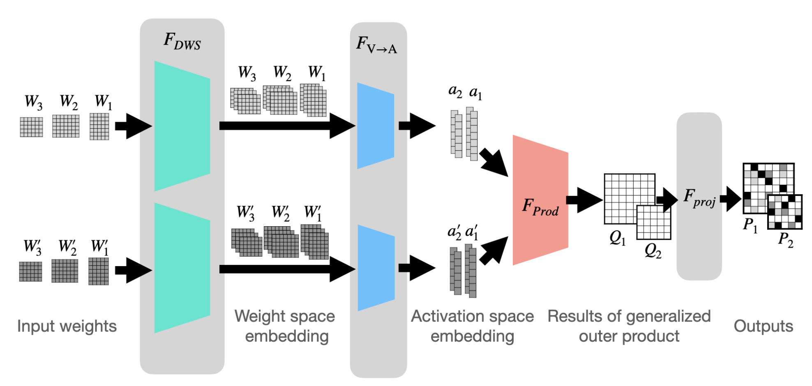

# deep-align
Official implementation of [_Equivariant Deep Weight Space Alignment_](https://arxiv.org/abs/2310.13397), ICML 2024



## Setup

- Create a virtual environment using conda, and install requirements:

```bash
conda create --name deep-align python=3.9
conda activate deep-align
conda install pytorch==2.0.1 torchvision==0.15.2 torchaudio==2.0.2 pytorch-cuda=11.7 -c pytorch -c nvidia
```

- Install the repo:

```bash
git clone https://github.com/AvivNavon/deep-align.git
cd deep-align
pip install -e .
```

## MLP experiments

To run the MLP experiments, use the following command:

```bash
cd experiments/mlp_image_classifier
```

## Credits

We utilized code provided by the following repositories:

- [Sinkhorn rebasin](https://github.com/fagp/sinkhorn-rebasin)
- [Git rebasin](https://github.com/samuela/git-re-basin)
- [DWSNets](https://github.com/AvivNavon/DWSNets)


If you find this code useful in your research, please consider citing:

```
@article{navon2023equivariant,
  title={Equivariant Deep Weight Space Alignment},
  author={Navon, Aviv and Shamsian, Aviv and Fetaya, Ethan and Chechik, Gal and Dym, Nadav and Maron, Haggai},
  journal={arXiv preprint arXiv:2310.13397},
  year={2023}
}
``` 